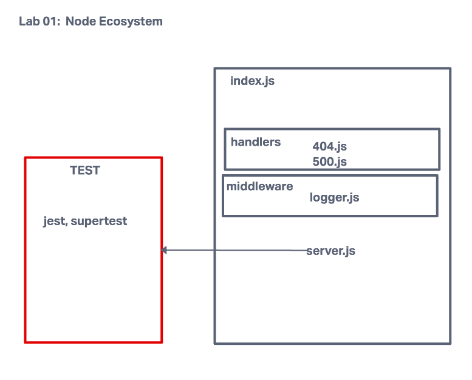

# LAB - Class 01

## Project: Node Ecosystem, CI, CD

### Author: Mandela Steele-Dadzie

### Problem Domain  

Today, you’ll create and deploy a web server using CI and CD and get used to the general process of building and deploying servers, and prepping your work for grading

### Links and Resources

### Setup

- npm init -y
- npm install dotenv express jest

#### How to initialize/run your application

- `npm start`

#### How to use your library (where applicable)

#### Features / Routes

- `/`
- `bad`
- `*`

#### Tests

- server.tests.js
`npm test`

#### UML

